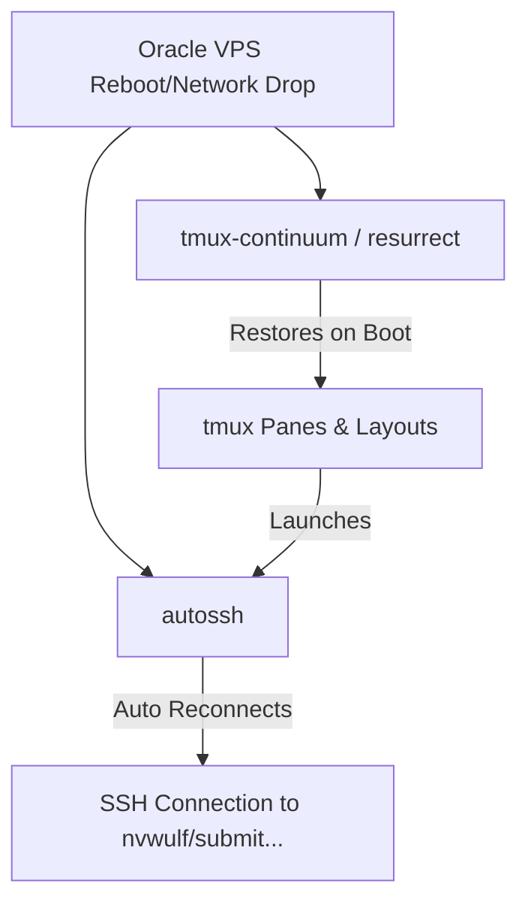

# Tmux & SSH Keepalive Guide

This guide documents the setup, usage, and maintenance of the automated **Tmux Session Resurrection** and **SSH Tunnel Keepalive** system. This system ensures that all active SSH tunnels and terminal sessions automatically survive system reboots (like Oracle VPS maintenance) and network drops.

---

## 1. System Architecture

The keepalive stack consists of three layers:



1. **`tmux-resurrect` & `tmux-continuum`**: Saves tmux session structures, pane layouts, and running process commands (`autossh`) every 15 minutes, and restores them automatically upon a system reboot.
2. **`autossh`**: Wraps the standard SSH client, monitors the connection state, and aggressively reconnects if the tunnel drops.
3. **SSH Native Keepalive**: Configured in `~/.ssh/config` to send silent heartbeat signals every 60 seconds to prevent firewalls from terminating idle connections.

---

## 2. Setup Reference

For reference, the following configuration was applied to Node 1 (`129.146.129.222`):

### A. Core Package Installation
```bash
sudo apt-get update && sudo apt-get install -y autossh
```

### B. Tmux Plugin Manager (TPM) Installation
```bash
git clone https://github.com/tmux-plugins/tpm ~/.tmux/plugins/tpm
```

### C. Tmux Configuration (`~/.tmux.conf`)
The configuration file [~/.tmux.conf](file:///home/ubuntu/.tmux.conf) was created with the following parameters:
```tmux
# Enable mouse support
set -g mouse on

# Increase history limit
set -g history-limit 50000

# Plugins
set -g @plugin 'tmux-plugins/tpm'
set -g @plugin 'tmux-plugins/tmux-sensible'
set -g @plugin 'tmux-plugins/tmux-resurrect'
set -g @plugin 'tmux-plugins/tmux-continuum'

# Keep pane terminal logs/history on resurrect
set -g @resurrect-capture-pane-contents 'on'

# Automatically restore ssh and autossh commands
set -g @resurrect-processes 'ssh autossh'

# Automatic restore when tmux server is started on boot
set -g @continuum-restore 'on'

# Autosave interval in minutes
set -g @continuum-save-interval '15'

# Initialize TMUX plugin manager
run '~/.tmux/plugins/tpm/tpm'
```

---

## 3. How to Use

### A. Establishing a Keep-Alive SSH Connection
When working in a tmux session, instead of running `ssh <target>`, use `autossh` with the `-M 0` option (which tells autossh to rely on the SSH config's internal heartbeats):

```bash
autossh -M 0 nvwulf
```
> [!NOTE]
> Since SSH Key authentication (passwordless login) is already configured for your SSH hosts, `autossh` will connect instantly without prompting for a password. If a password were required, automatic recovery would halt at the password prompt.

### B. Tmux Session Commands
* **Manual Save**: Press `Ctrl + b` followed by `Ctrl + s`. You will see `Saving tmux...` at the bottom left.
* **Manual Restore**: Press `Ctrl + b` followed by `Ctrl + r`.
* **Automatic Save**: Happens silently in the background every 15 minutes.
* **Automatic Restore**: Triggers automatically the first time you launch `tmux` after a system reboot.

### C. SSH Connection Heartbeats
Keepalive heartbeats are defined per host in [~/.ssh/config](file:///home/ubuntu/.ssh/config) to keep tunnels open natively:
```text
Host nvwulf
    HostName login.nvwulf.stonybrook.edu
    User jichao
    ServerAliveInterval 60
    ServerAliveCountMax 10
```
- `ServerAliveInterval 60`: Sends a dummy packet every 60 seconds of inactivity.
- `ServerAliveCountMax 10`: If 10 consecutive packets fail (10 minutes total), the connection is marked as dead, triggering `autossh` to immediately teardown and rebuild the connection.
